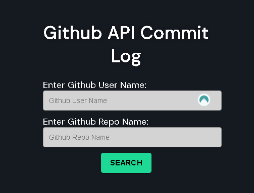
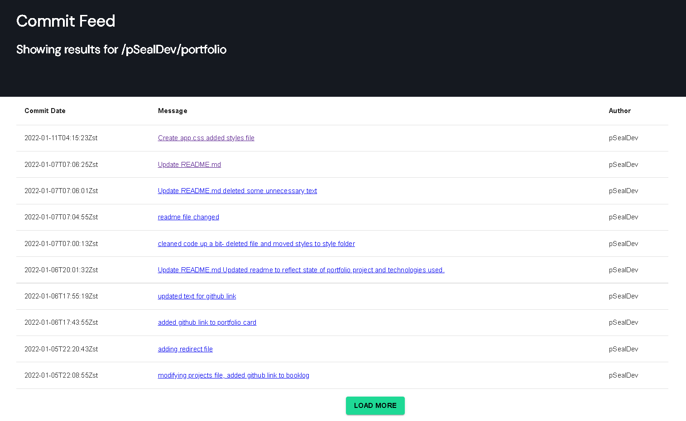

This project was bootstrapped with [Create React App](https://github.com/facebook/create-react-app).

# PSeal Github API Commit Log for Chronosphere

PSeal Github API Commit Log is an app that returns all commit messages and links for the given username and reponame. 

_____________________________________________________________________________________________________________________

The commit feed only returns the date, commit message with a link, and the name of the author. 

### Installation

### `npm install`
This will install all the dependencies.

In the project directory, you can run:

### `npm start`

Runs the app in the development mode.\
Open [http://localhost:3000](http://localhost:3000) to view it in your browser.

### `npm run test`

This will run the available unit tests. 

All tests are powered by React-Testing-Library and testing-library/jest-dom

### More about the project

### Github access token

You will need a Github Access Token.

### Page not found

The project should return a "page not found" view if a url path is not valid. 

### does/not/exist

The app should append to the url "does/not/exist" if the wrong userName or repoName is input by the user, and should stay on the home form.

### Todo

I would like to add more unit tests, especially for the results page.

